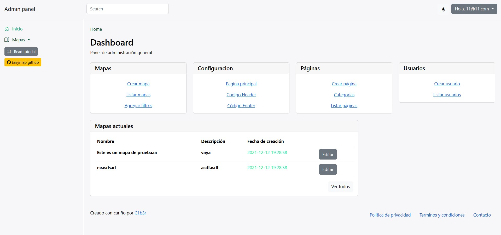

# Easymap
Crea tu mapa con ayuda de la libería leafletjs.
Con un panel de administración personalizable.
El proyecto empezó como un framework php nativo y evolucionó a un proyecto apoyado en librerías de illuminate.
Las librerías illuminate en su última versión (10.x). Empezó en la 8.X siguiendo los ejemplos de laravel [torch](https://github.com/mattstauffer/Torch/tree/master).
Se utilizan las siguientes librerías:
- "illuminate/database": "^10.14.1"
- "illuminate/pagination": "^10.14.1"
- "illuminate/routing": "^10.14.1",
- "illuminate/events": "^10.14.1",
- "illuminate/translation": "^10.14.1",
- "illuminate/validation": "^10.14.1",
- "twbs/bootstrap": "5.2.3",
- "twbs/bootstrap-icons": "^1.8"

Las librerías de bootstrap se moverán automáticamente a las carpetas correspondientes (estoy practicando tailwind)

## Instalación
Se adjunta una base de datos de prueba para observar las tablas, el usuario predeterminado es 11@11.com con la contraseña 11.
El fichero de ejemplo de configuración de base de datos se encuentra dentro de la carpeta config.
Si se necesita que el fichero esté en la misma carpeta, puede modificarse la línea del fichero boot.php 
```sh
require_once ROOT_PATH.'../conf.php'; //recommended path
```
Esta línea indica que el fichero de configuración se encuentre fuera de la carpeta del proyecto. 



Lo pendiente por hacer de este proyecto es visualizar los mapas, agregar los filtros y asociarlos a los puntos para poder verlos posteriormente en el visor.